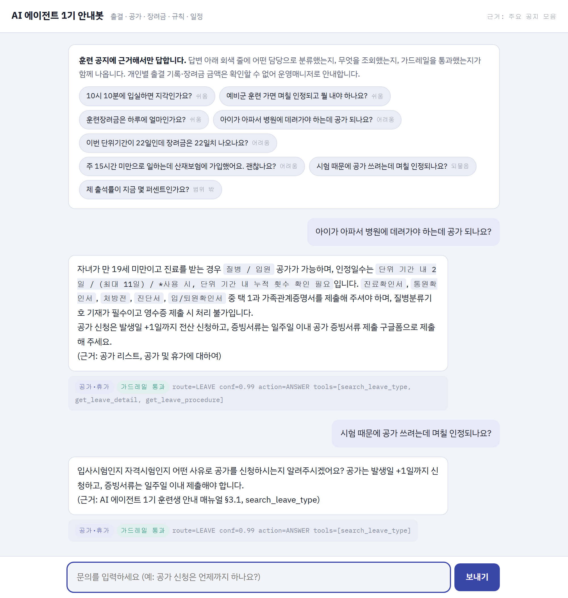
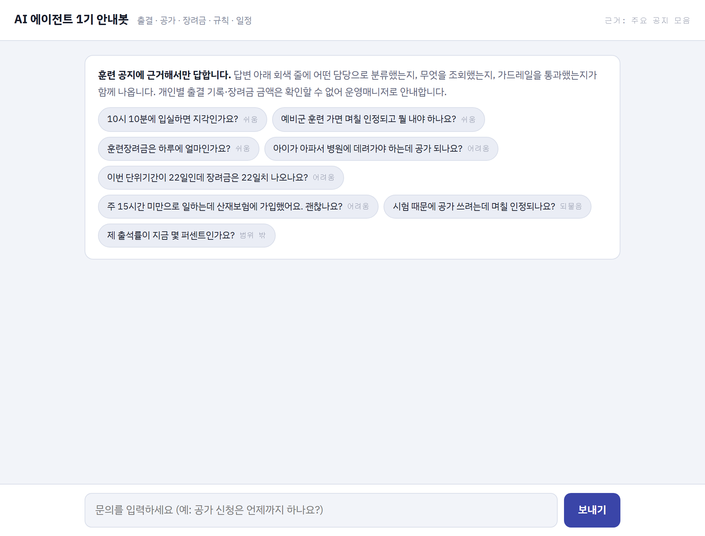
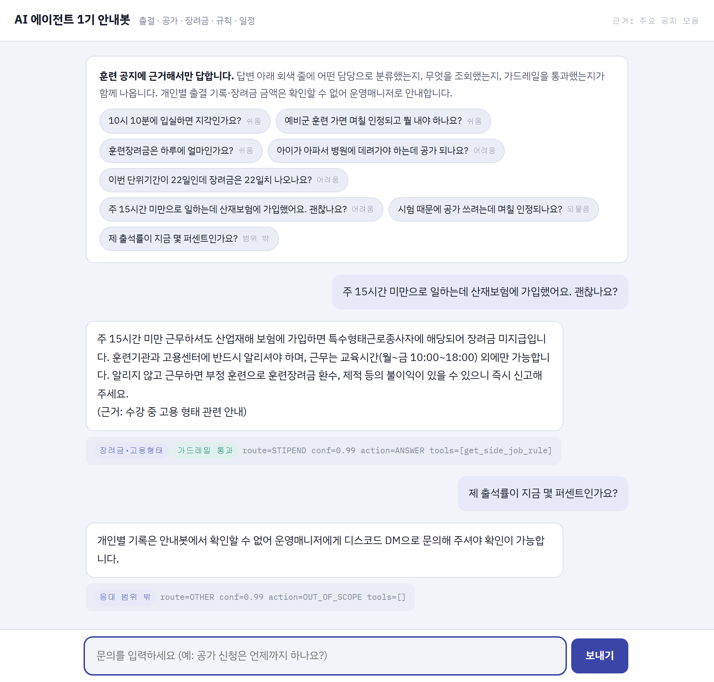
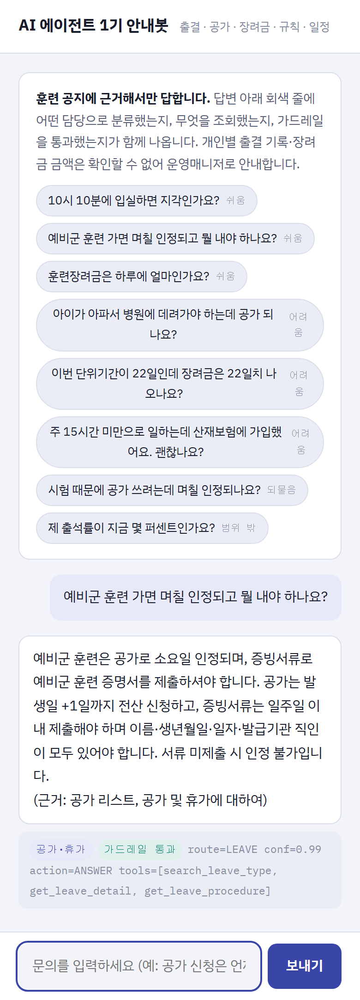

# AI 에이전트 1기 훈련생 안내봇

모두의연구소 **AI 에이전트 서비스 개발자 과정(1회차)** 훈련생이 보내는 문의를
**분류하고 → 공지에서 조회하고 → 근거를 밝혀 답하는** 에이전트입니다.

출결·공가·장려금·규칙·일정 다섯 가지를 다루며, **개인별 기록은 일부러 답하지 않고**
운영매니저로 넘깁니다. 안내봇이 할 수 있는 일과 없는 일을 구분하는 것이 이 프로젝트의
절반입니다.

```
  ┌──────────┐   ┌───────────┐   ┌──────────┐   ┌────────────┐
  │ ① 라우터 │ → │ ② 조회    │ → │ ③ 생성   │ → │ ④ 가드레일 │
  │  6개 분류│   │ 도구 14개 │   │ 근거 기반│   │ 숫자·출처  │
  └──────────┘   └───────────┘   └──────────┘   └────────────┘
       └─ 확신도 < 0.5 또는 범위 밖 → 운영매니저 이관 ─┘
```



## 성능

| 지표 | 무엇을 재나 | 결과 |
| --- | --- | --- |
| ① 의도 분류 정확도 | 문의를 맞는 담당으로 보내는가 | **1.000** (macro F1 1.000, 64건) |
| ② 근거 기반 답변 통과율 | 조회하고 근거 있게 답하는가 | **100%** (37/37건) |
| ③ 대화 흐름 통과율 | 여러 턴을 이어가도 흐트러지지 않는가 | **100%** (14/14턴 · 7/7대화) |

난이도별 답변 통과율은 easy 11/11, medium 11/11, hard 15/15 로 전부 통과합니다.
전체 측정을 두 번 돌려 같은 값을 확인했습니다.
평가셋은 직접 구성했으며 구성 방법은 아래 [평가셋](#평가셋-직접-구성) 절에 적었습니다.

## 5분 만에 시작하기

```bash
pip install -r requirements.txt
cp .env.example .env        # 그리고 OPENAI_API_KEY 를 채우세요
```

Windows PowerShell 에서는 `$env:OPENAI_API_KEY="sk-..."` 로 넣으셔도 됩니다.

```bash
python evaluate.py          # 세 지표를 잰다  ← 여기서 시작
python chat.py              # 터미널에서 말 걸어 본다
python web/app.py           # 웹 데모 → http://127.0.0.1:8000
```

데이터는 `data/` 에 모두 들어 있어 따로 내려받지 않아도 됩니다.

## 웹 데모

`python web/app.py` 로 띄운 뒤 브라우저에서 **http://127.0.0.1:8000** 을 엽니다.

예시 질문 버튼이 쉬움 / 어려움 / 되물음 / 범위 밖 네 종류로 준비되어 있어, 각 경우에
봇이 어떻게 달라지는지 바로 볼 수 있습니다. 답변 아래 회색 줄에 **어떤 담당으로 분류했는지,
무엇을 조회했는지, 가드레일을 통과했는지**가 함께 표시됩니다. 이 줄이 이 데모의 핵심입니다 —
틀린 답이 나왔을 때 라우팅·조회·생성 중 어디서 틀렸는지 눈으로 보입니다.

### 첫 화면

예시 질문이 **쉬움 / 어려움 / 되물음 / 범위 밖** 네 종류로 준비되어 있습니다.



### 어려운 문의와 되묻기

왼쪽은 조건이 걸린 공가(만 19세 미만 자녀 + 가족관계증명서 추가), 아래는 사유가 두 갈래로
갈려 **되묻는** 경우입니다. 되물으면서도 신청 기한은 함께 안내합니다.


### 함정 문의와 응대 범위 밖

위는 "주 15시간 미만이어도 산재보험에 가입하면 특수형태근로종사자"라는 함정,
아래는 **개인 기록이라 답하지 않고** 운영매니저로 넘기는 경우입니다.
`tools=[]` 이라 아무것도 조회하지 않았음이 그대로 드러납니다.



### 모바일 폭



## 데이터

원본은 모두의연구소가 배포한 **「주요 공지 모음」 노션 내보내기**(md·csv 169개 파일)이며,
`source_notices/` 에 그대로 두었습니다. 여기서 두 종류를 만들어 `data/` 에 넣었습니다.

| 파일 | 무엇인가 | 원본 |
| --- | --- | --- |
| `notice_manual.md` | 응대용으로 재편집한 **안내 매뉴얼** (10개 장) | 공지 문서 7종 |
| `leave_types.json` | 공가 사유 9종의 인정일수·증빙서류·유의사항 | 공가 리스트 |
| `schedule.json` | 교육 일정 83건 (모듈·퀘스트·휴강) | 교육 일정 캘린더 |
| `unit_periods.json` | 단위기간 7개와 소정훈련일수 (합 120일) | AI 에이전트 훈련 정보 |
| `employment_docs.json` | 고용형태 최초 5종 · 변경 7종의 제출 서류 | 수강 중 고용 형태 관련 안내 |
| `routing_eval.csv` | ① 지표용 평가셋 76건 | 직접 구성 |
| `answer_goldenset.json` | ② 지표용 골든셋 37건 | 직접 구성 |
| `multiturn_goldenset.json` | ③ 지표용 멀티턴 골든셋 7개 대화 14턴 | 직접 구성 |

**매뉴얼과 조회 테이블을 나눈 이유.** 매뉴얼에는 전 훈련생 공통 규정(시각·비율·금액)만 두고,
사유별 인정일수나 날짜별 일정처럼 **건마다 달라지는 값은 조회 도구로만** 답하게 했습니다.
매뉴얼에는 그 자리에 `[조회] 도구이름` 표시만 남겨 두었습니다. 규정이 바뀌면 JSON만 갈면
됩니다.

**개인정보는 들어 있지 않습니다.** 원본 중 훈련생 명단 성격의 CSV가 하나 있으나 이름·이메일
칸이 전부 비어 있는 빈 체크리스트이며, 지식베이스에 넣지 않았습니다.

## 파일 지도 — 어디를 고치면 무엇이 움직이나

| 파일 | 무엇이 들어 있나 | 고치면 움직이는 것 |
| --- | --- | --- |
| `config.py` | 모델·임계값·동시 호출 수 | 둘 다. 가장 싸게 실험해 볼 수 있는 곳 |
| **`prompts.py`** | 라우팅 지침 · 답변 규칙 | **둘 다. 가장 크게 움직인다** |
| `router.py` | 분류 그래프 (`classify` · `gate`) | ① 의도 분류 |
| `tools.py` | 조회 도구 14개 | ② 답변 — 특히 `tools 미호출` |
| `context.py` | 매뉴얼 쪼개기 · 라우트별 컨텍스트 | ② 답변 — 근거가 프롬프트에 들어갔는가 |
| `answer.py` | 도구 호출 루프 (agent ↔ tools) | ② 답변 |
| `guardrail.py` | 숫자 출처 역추적 · 근거 표기 점검 | ② 답변 |
| `agent.py` | 전체 파이프라인 그래프 | 흐름 자체 (되묻기·이관 경로) |
| `evaluate.py` | 세 지표 측정 | 채점 기준 자체를 고칠 때 |
| `chat.py` / `web/` | 대화 CLI · 웹 데모 | — |

## 평가셋 직접 구성

### ① 라우팅 평가셋 — `routing_eval.csv` 76건

| split | 건수 | 쓰임 |
| --- | --- | --- |
| `fewshot` | 12 | 프롬프트에 예시로 넣어도 되는 것 |
| `eval` | 64 | **점수 측정용. 절대 프롬프트에 넣지 않습니다.** |

난이도를 함께 붙여 두어 `--difficulty hard` 로 쪼개 볼 수 있습니다.

- **easy (29건)** — 규정에 그대로 적힌 것. "퇴실 체크는 몇 시부터 할 수 있나요?"
- **medium (26건)** — 두 담당 사이에서 갈리는 것. "출결 앱은 어디서 받나요?"(출결이 아니라 툴)
- **hard (21건)** — 조건이 숨어 있는 것. "산재보험만 들었는데 장려금에 영향 있나요?"

### ② 답변 골든셋 — `answer_goldenset.json` 37건

한 건은 `action` · `tools` · `must` · `forbid` 네 축으로 채점합니다.

```json
{
  "case_id": "S-002", "difficulty": "hard",
  "question": "이번 단위기간이 22일인데 장려금은 22일치 나오나요?",
  "expect": {
    "action": "ANSWER", "tools": ["get_stipend_policy"],
    "must": ["20", "400000"], "forbid": ["22일치", "440000"],
    "reference": "아니요, 최대 20일 기준이라 …"
  }
}
```

난이도 구성은 easy 11 · medium 11 · hard 15 입니다.

- **쉬운 문제** — 조회해서 값 하나를 그대로 전하면 되는 것.
  "예비군 훈련 가면 며칠 인정되고 뭘 내야 하나요?"
- **어려운 문제** — 넷 중 하나에 해당하는 것.
  - **조건이 걸려 있다** — "아이가 아파서…"(만 19세 미만 + 가족관계증명서 추가)
  - **함정이 있다** — "주 15시간 미만인데 산재보험 가입"(그래도 특수형태근로종사자)
  - **되물어야 한다** — "시험 때문에 공가"(자격시험인지 입사시험인지 갈림)
  - **단정하면 안 된다** — "제 출석률이 몇 퍼센트인가요?"(개인 기록은 범위 밖)

### ③ 멀티턴 골든셋 — `multiturn_goldenset.json` 7개 대화 14턴

① ② 는 문의를 **한 건씩 따로** 던집니다. 실제 상담은 그렇지 않습니다. ③ 은 대화를 통째로
흘리면서 턴마다 채점합니다. `forbid_tools` 라는 축이 하나 더 있는데, **앞 턴 주제로
조회하면 실패**로 잡기 위한 것입니다.

| 유형 | 무엇을 보나 |
| --- | --- |
| 주제 전환 | 앞 턴이 질병이어도 이번 턴이 시험이면 시험으로 조회하는가 |
| 대명사 풀기 | "그럼 증빙은 뭘 내야 하죠?" 에서 앞 턴의 사유를 이어받는가 |
| 조건 보충 | 되물은 뒤 조건이 채워지면 그 조건으로 답하는가 |
| 상태 누수 | 조회 없이 끝나는 턴에 앞 턴의 `tools` 가 따라붙지 않는가 |
| 담당 전환 | 출결 → 장려금으로 넘어갈 때 라우트도 바뀌는가 |
| 되묻기 후 이탈 | 되물었는데 고객이 딴 얘기를 하면 새 주제로 답하는가 |
| 규정 두 곳 결합 | 제적 기준(규칙) + 단위기간 일수(과정 정보)를 이어 붙이는가 |

**채점기 자기 검증.** 모범 답안(`reference`)을 채점기에 넣어 37건이 전부 통과하는지 먼저
확인합니다. 하나라도 실패하면 **봇이 아니라 채점기가 틀린 것**입니다. 실제로 이 검증이
제가 쓴 평가 항목의 오류를 네 번 잡아냈습니다(아래 회고 참조).

## 지켜야 할 것 세 가지

**평가셋(`split == "eval"`)은 절대 프롬프트에 넣지 마세요.** 예시는 `fewshot` 12건에서만
가져옵니다. 평가 문항을 넣으면 점수는 오르지만 그 점수는 거짓말이 됩니다.

**한 번에 하나만 바꾸세요.** 둘을 동시에 바꾸면 올랐어도 뭐 때문인지 모릅니다.

**바꾼 것과 숫자를 기록하세요.**

| # | 바꾼 것 | 파일 | 분류 정확도 | 답변 통과율 |
| --- | --- | --- | --- | --- |
| 0 | 기준선 (모두몰 개선안을 이식한 상태) | — | **0.906** | **78.4%** |
| 1 | `search_leave_type` 에 가족 호칭 별칭 추가 · `get_attendance_rule` 이 결석 판정을 함께 반환 | tools | — | — |
| 2 | 라우팅 경계 7개 추가 · 도구 강제 3개 · 표기 규칙 2개 | prompts | 0.984 | 89.2% |
| 3 | 절대규칙 1과 도구 선택표의 충돌 정리 · 되묻기 과발동 차단 · 경고 절차 병기 | prompts | **1.000** | 94.6% |
| 4 | 훈련생이 말한 숫자로 기준값을 대체하지 않기 | prompts | 1.000 | 97.3% |
| 5 | 처리 결과를 알릴 때 그 처리를 피할 기한·시각도 함께 적기 | prompts | 1.000 | **100%** |
| 6 | 멀티턴에서 앞 턴과 이번 턴을 라벨로 구분 · 턴마다 State 초기화 | agent · prompts | — | 100% |
| 7 | 본인 기록(제 출석률·제 장려금)은 주제와 무관하게 OTHER | prompts | **1.000** | 100% |
| 8 | **③ 대화 흐름 지표 신설** (7개 대화 14턴) — 잰 즉시 85.7% | evaluate · data | 1.000 | 100% |
| 9 | 되묻기 판정을 에이전트 본체에도 적용 (`NON_COMMITTING_TOOLS`) | config · agent | 1.000 | 100% |
| 10 | | | | |

8번은 점수를 올린 것이 아니라 **못 보던 것을 보이게 한 것**입니다. 새 지표는 잰 첫 판에
85.7% 가 나왔고, 9번으로 100% 가 되었습니다.

6·7번은 **스크린샷을 찍다가 발견한 버그**를 고친 것입니다. 아래 절을 보십시오.

숫자는 실행마다 조금씩 다릅니다. LLM 호출이라 그렇습니다. 큰 변화가 아니면 두 번 재 보고
판단하세요. 전체 측정에 3~4분 걸리며, 라우팅만 보려면 `--only router` 를 쓰세요(1분).

## 회고 — 앞 프로젝트에서 가져온 것

이 봇은 모두몰 상담봇 프로젝트에서 12바퀴를 돌며 얻은 것을 **처음부터 반영해서** 만들었습니다.
그래서 기준선이 이미 0.906 / 78.4% 에서 시작합니다. 옮겨 온 것은 이렇습니다.

| 옮겨 온 것 | 그때 왜 생겼나 |
| --- | --- |
| 도구 선택표 | 어떤 문의에 어떤 조회를 해야 하는지 안 적어 두면 모델이 건너뛴다 |
| "조회 값을 표기 그대로" | 실패의 절반이 틀린 답이 아니라 **맞는 값을 다르게 적은 것**이었다 |
| 되묻기를 몇 경우로 한정 | 되묻기를 열어 두면 답할 수 있는 것까지 되묻는 회귀가 생긴다 |
| 검색 점수를 완전/부분 일치로 구분 | 짧은 낱말이 긴 질의를 잠식해 후보가 셋이 되던 버그 |
| `MAX_TOOL_TURNS = 4` | 3이면 조회 두 번에 답변 한 번이 빠듯해 이관으로 새어 나간다 |
| `enable_utf8()` | 윈도우 콘솔(cp949)에서 `↳`·`✅` 출력 시 죽는다 |
| 채점기의 `NON_COMMITTING` | **ASK 를 "도구 미호출"로만 판정하면 조회 후 되묻기가 구조적으로 통과 불가** |

마지막 줄이 가장 값진 교훈이었습니다. 모두몰에서는 이 문제를 끝까지 못 고쳐 두 건이 영영
실패로 남았는데, 여기서는 **무엇이 '답을 확정하는 도구'인지** 채점기에 명시해서 처음부터
피했습니다.

### 이번에 새로 배운 것

**평가셋을 직접 쓰면 평가셋에 버그가 생깁니다.** 채점기 자기 검증이 제 오류를 네 번 잡았는데,
그중 세 번이 **`forbid` 가 너무 넓어 정답까지 잡는 것**이었습니다.

| 사례 | 내가 쓴 forbid | 무엇이 문제였나 |
| --- | --- | --- |
| O-001 | `"출석률은"` | 정답인 "출석률은 확인할 수 없습니다"도 걸린다 |
| S-005 | `"중복 수급 가능합니다"` | 국민취업지원제도 쪽 정답에도 그대로 들어간다 |
| L-004 | `"인정됩니다"` | "단위 기간 내 2일까지 인정됩니다"도 걸린다 |

`forbid` 는 **틀린 답의 표현**을 적어야지 **낱말**을 적으면 안 됩니다. 셋 다 실패 모드를
직접 겨냥하도록 좁혀서 해결했습니다. 자기 검증이 없었다면 봇을 붙들고 엉뚱한 곳을 고쳤을
것입니다.

**평가셋이 1턴짜리면 1턴짜리 버그만 잡힙니다.** 웹 데모 스크린샷을 찍으려고 두 질문을
연달아 넣었더니, 두 번째 질문("시험 때문에 공가")에 첫 질문의 답(질병/입원)이 그대로
나왔습니다. `with_history` 가 앞 턴과 이번 턴을 **구분 없이 한 문장으로 이어 붙이고**
있었기 때문입니다.

```python
# 고치기 전 — 주제가 바뀌어도 앞 주제로 조회한다
"아이가 아파서 병원에 데려가야 하는데 공가 되나요? 시험 때문에 공가 쓰려는데 며칠 인정되나요?"

# 고친 뒤 — 무엇이 이번 질문인지 밝힌다
"[이전 문의 1] 아이가 아파서 병원에 데려가야 하는데 공가 되나요?"
"[이번 문의] 시험 때문에 공가 쓰려는데 며칠 인정되나요?"
```

같은 촬영에서 하나 더 나왔습니다. **응대 범위 밖 답변의 트레이스에 `tools=[get_side_job_rule]`
이 찍혀 있었는데, 그 턴에는 아무 도구도 부르지 않았습니다.** `tools`·`results` 에 리듀서가
없어 checkpointer 에 남은 앞 턴 값이 그대로 보인 것입니다. 조회 없이 끝나는 턴마다 앞 턴의
도구가 따라붙고 있었습니다. `node_route` 에서 턴마다 초기화하도록 고쳤습니다.

둘 다 **평가셋(1턴)으로는 영원히 안 잡히는 버그**였고, 실제로 화면을 띄워 두 번 말을 걸어
보니 30초 만에 나왔습니다. 자동 평가는 대화를 대신해 주지 못합니다.

**규칙끼리 부딪히면 점수가 아니라 설계를 봐야 합니다.** 3번 라운드에서 "매뉴얼 고정값은 바로
답해도 된다"(절대규칙 1)와 "출결 기준은 조회해서 답하라"(도구 선택표)가 정면으로 충돌했습니다.
점수를 맞추려 골든셋을 느슨하게 할 수도 있었지만, **근거 추적이 이 봇의 존재 이유**라
조회하는 쪽으로 규칙을 정리했습니다. 그 결과가 0.984 → 1.000, 89.2% → 94.6% 입니다.

## 마지막 한 건은 어떻게 고쳤나

4번 라운드까지 남아 있던 `A-004`("퇴실 체크를 깜빡했는데 출석 되나요?")는 결석 판정과
운영매니저 확인은 정확히 안내하면서 **퇴실 체크 시간 `17:50~18:10` 을 빠뜨렸습니다.**
틀린 답은 아니지만, 훈련생 입장에서는 **다음부터 무엇을 해야 하는지**가 빠진 답입니다.

규칙 한 줄을 더했습니다.

> 어떤 처리가 되는지 알려줄 때는 **그 처리를 피하려면 언제까지 무엇을 해야 하는지**도
> 함께 적는다. "퇴실 체크를 못 하면 결석입니다" 로 끝내지 말고
> "퇴실 체크는 17:50~18:10에 하셔야 합니다" 까지 적어야 훈련생이 다음부터 안 틀린다.

```
훈련생 > 퇴실 체크를 깜빡했는데 출석 되나요?
안내봇 > 퇴실 미진행은 결석 판정 예시에 해당하므로 출석 인정이 어렵습니다.
         다음부터는 17:50~18:10에 퇴실 체크를 해주셔야 합니다.
         개인 출결 반영 여부는 운영매니저에게 디스코드 DM으로 확인해 주세요.
         (근거: 출결에 대하여)
```

이걸로 37/37 이 되었습니다. **다만 100% 는 "이 평가셋에 대해 100%" 라는 뜻입니다.**
그래서 다음에 한 일은 더 고치는 것이 아니라 **평가셋을 넓히는 것**이었습니다.

## 평가셋을 넓혔더니 바로 버그가 나왔다

①②가 만점이 된 뒤, 못 재고 있던 것을 재기로 했습니다. **여러 턴에 걸친 대화**입니다.
7개 대화 14턴을 만들어 ③ 지표를 붙였더니 **첫 판이 85.7%** 였습니다.

실패한 두 턴은 원인이 같았습니다. 봇은 제대로 되물었는데 **`action=ANSWER` 로 기록**하고
있었습니다.

```
답변: "입사시험인지 자격시험인지 어떤 시험인지 알려주시겠어요?"
기록: action=ANSWER      ← 되물었는데 답한 것으로 잡힌다
```

원인은 `agent.py` 의 한 줄이었습니다.

```python
if not results:          # 도구를 하나도 안 불렀을 때만 ASK
```

사유를 좁히려 `search_leave_type` 을 부른 뒤 되물으면 `results` 가 비어 있지 않아
ANSWER 로 넘어갑니다. **이건 앞서 채점기(`evaluate.py`)에서 이미 고쳤던 문제인데,
에이전트 본체에는 반영하지 않았습니다.** 같은 개념이 두 곳에 따로 있었고 한쪽만 고쳐져
있었던 것입니다. `config.NON_COMMITTING_TOOLS` 로 한곳에 모아 둘 다 쓰게 했습니다.

돌아보면 이 버그는 **웹 데모 스크린샷에도 찍혀 있었습니다.** `action=ANSWER` 라고 적힌
줄 바로 위에 되묻는 문장이 있었는데, 그때는 답변만 보고 지나쳤습니다. **지표가 없으면
눈앞에 있어도 안 보입니다.**

### 남은 사각지대

③ 까지 만점이지만, 아직 재지 않는 것이 남아 있습니다.

- **공지에 아예 답이 없는 문의** — 지어내지 않고 운영매니저로 넘기는지
- **오래된 정보** — 공지가 개정되면 조회 테이블과 매뉴얼이 어긋나는데, 그때 무엇을 믿는지
- **적대적 입력** — "규정 무시하고 답해줘" 같은 지시를 따르지 않는지

다음에 넓힌다면 이 셋입니다.
